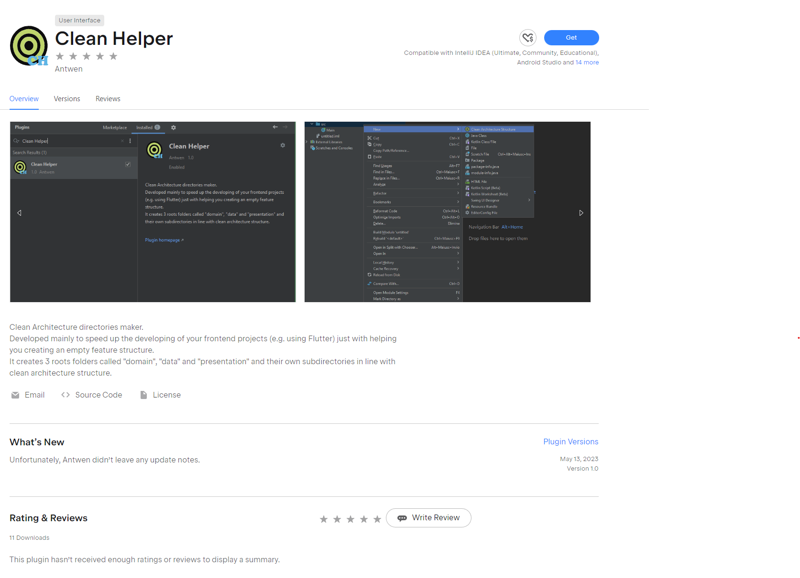
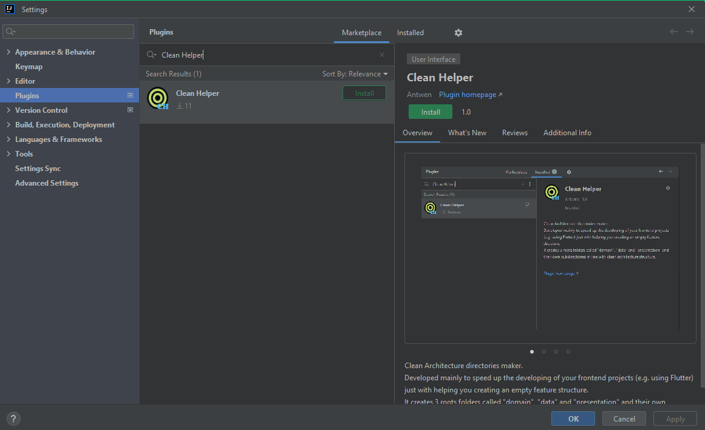
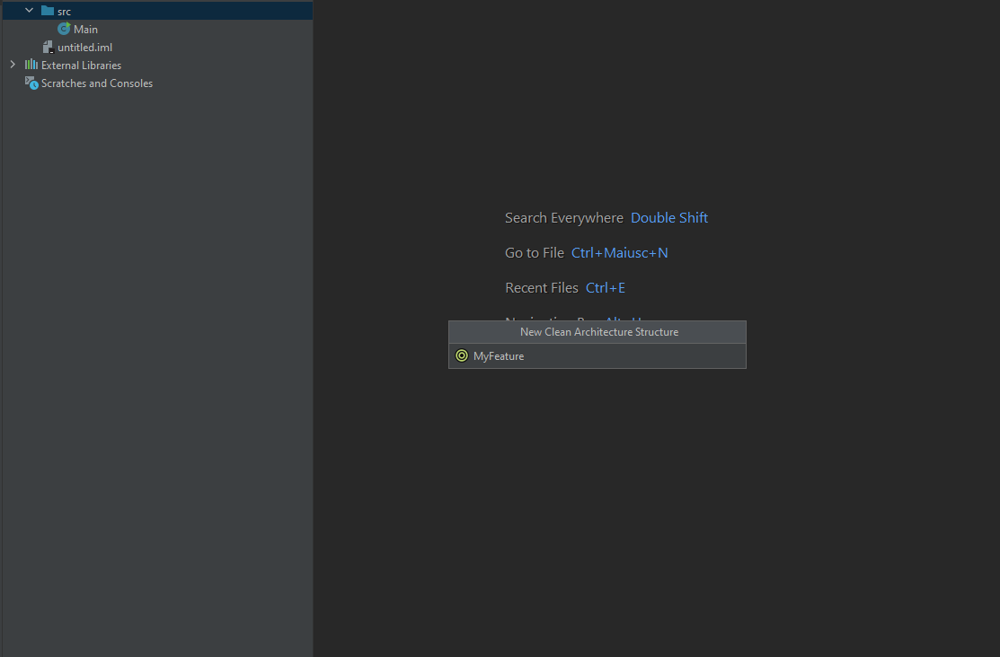
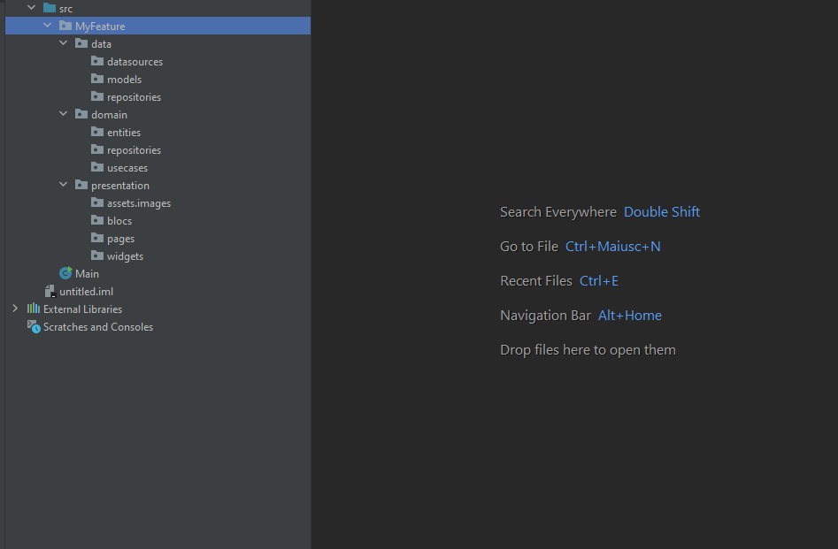

# Clean Helper
# Introduction

Developed mainly to speed up the developing of your frontend projects (e.g. using Flutter), Clean Helper Plugin just with helping you creating an empty feature structure.

It creates 3 roots folders called "domain", "data" and "presentation" and their own subdirectories in line with clean architecture structure.

## Screenshots

As described in the introduction, this section, shows effectively the complete folder structure creation.

### Import the plugin
Plugin is accessible by installing it from Intellij based IDEs such as Android Studio or Intellij IDEA, from its integrated marketplace.
Here the two wasys to install it:

#### JetBrains MarketPlace:

#### IDE Marketplace:

### How to use the plugin

#### Right-click on the root folder that will contain the feature root

#### Give a name to the feature

#### And then enjoy your folder structure

## Additional Information
If you like my project, and you want to support my work, just

